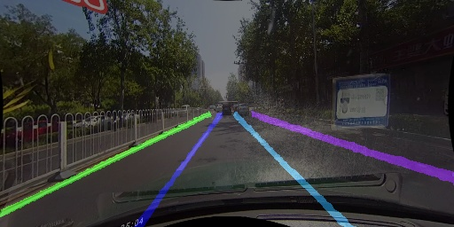
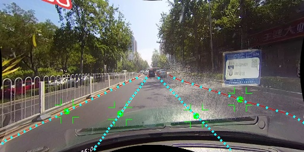

# CenLaneNet

This is an implementation of  "":

​                                                                                              



### Quick starts:

1) Evaluating tusimple

```
python A2_Test_tusimple.py --TusimpleTesting_root "yourTusimplePath/test_set/"
```

2) Evaluating Culane

```
python A1_Test_culane.py --CUlane_dataroot "/home/sunyi/sy/data/LaneDetection/CULane/"
```

3) Post-Processing comparison

```
python A3_Postprocess_cost_test.py --TusimpleTesting_root  "yourTusimplePath/test_set/" --show 1
```


### Training your own model:

1) preparing ground_truth--tusimple

```
python D0_CreateTusimpleGt.py --tusimple_root "/home/sunyi/sy/data/LaneDetection/tusimple_raw/tosunyi/train_set/" --GtDataroot  "./"
```

2) Training

```
python A0_Train.py --GtDataroot "/home/sunyi/sy/data/LaneDetection/tusimple/"
```

(Code for generating the Gt of Culane will come soon....)